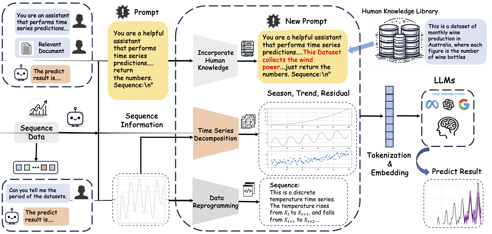

# Time-Series-Forecasting-with-LLMs

Large language models (LLMs) have been applied in many fields and have developed rapidly in recent years. As a classic machine learning task, time series forecasting has recently been boosted by LLMs. Recent works treat large language models as \emph{zero-shot} time series reasoners without further fine-tuning, which achieves remarkable performance. However, some unexplored research problems exist when applying LLMs for time series forecasting under the zero-shot setting. For instance, the LLMs' preferences for the input time series are less understood. In this paper, by comparing LLMs with traditional time series forecasting models, we observe many interesting properties of LLMs in the context of time series forecasting. First, our study shows that LLMs perform well in predicting time series with clear patterns and trends but face challenges with datasets lacking periodicity. This observation can be explained by the ability of LLMs to recognize the underlying period within datasets, which is supported by our experiments. In addition, the input strategy is investigated, and it is found that incorporating external knowledge and adopting natural language paraphrases substantially improve the predictive performance of LLMs for time series. Our study contributes insight into LLMs' advantages and limitations in time series forecasting under different conditions.

This work has been accepted by the **SIGKDD Explorations Newsletter**.


#### Datasets
```
Please create:

datasets/memorization
datasets/monash
datasets/synthetic

The corresponding time series dataset in the article should be placed in the above directory.
```

#### Citation
If you find the code is vailuable, please use this citation.
```
@article{tang2024time,
  title={Time series forecasting with llms: Understanding and enhancing model capabilities},
  author={Tang, Hua and Zhang, Chong and Jin, Mingyu and Yu, Qinkai and Liu, Chengzhi and Zhu, Suiyuan and Zhang, Yongfeng and Du, Mengnan},
  journal={arXiv preprint arXiv:2402.10835},
  year={2024}
}
```
